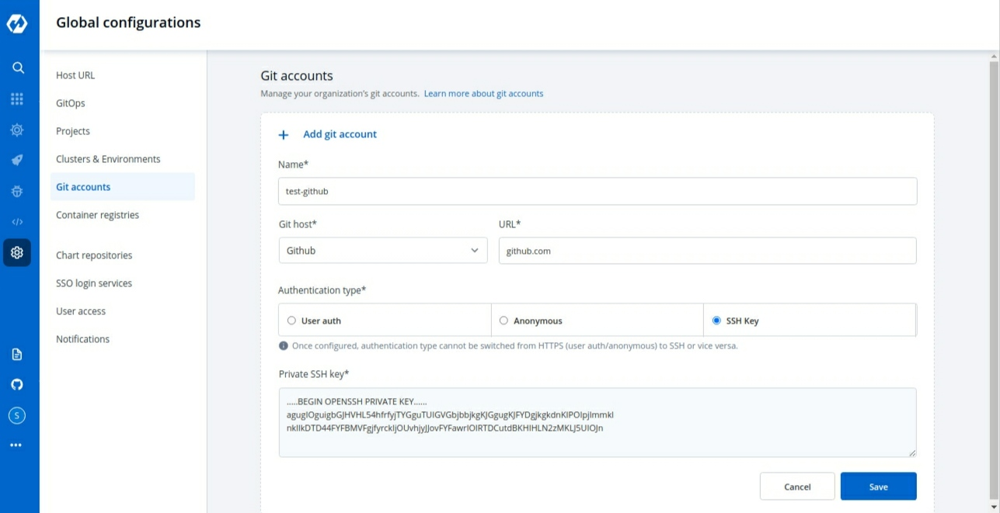

# Git Accounts

Git Accounts allow you to connect your code source with Devtron. You’ll be able to use these git accounts to build code using the CI pipeline.

## Git Account Configuration

`Global Configuration` helps you to add a Git provider. Click on `Add git account` button at the top of the Git Account Section. To add a new git provider, add the details as mentioned below.

1. Name
2. Git Host
3. URL
4. Authentication type

### 1. Name

Provide a `Name` to your Git provider. This name will be displayed in the the Git Provider drop-down inside the Git Material configuration section.

### 2. Git Host

It is the git provider on which corresponding application git repository is hosted. By default you will get Bitbucket and GitHub but you can add many as you want clicking on **[+ Add Git Host]**.

### 3. URL

Provide the `URL`. **For example**- [https://github.com](https://github.com) for Github, [https://gitlab.com](https://gitlab.com) for GitLab, etc.

### 4. Authentication type

Here you have to provide the type of authentication required by your version controller. We support three types of authentications. You can choose the one that suits you the best.

* **Anonymous**

If you select `Anonymous` then you do not have to provide any username, password/authentication token or SSH key. Just click on `Save` to save your git account provider details.

* **User Auth**

If you select `User Auth` then you have to provide the `Username` and either of `Password` or `Auth Token` for the authentication of your version controller account. Click on `Save` to save your git account provider details.

* **SSH Key**

If you choose `SSH Key` then you have to provide the `Private SSH Key` corresponding to the public key added in your version controller account. Click on `Save` to save your git account provider details.

## Update Git Account

You can update your saved git account settings at any point in time. Just click on the git account which you want to update. Make the required changes and click on `Update` to save you changes.

Updates can only be made within one Authentication type or one protocol type, i.e. HTTPS(Anonymous or User Auth) & SSH. You can update from Anonymous to User Auth & vice versa, but not from Anonymous/User Auth to SSH or reverse.

### Note:

You can enable and disable your git account settings. If you enable it, then you will be able to see that enabled git account in the drop-down of Git provider.

